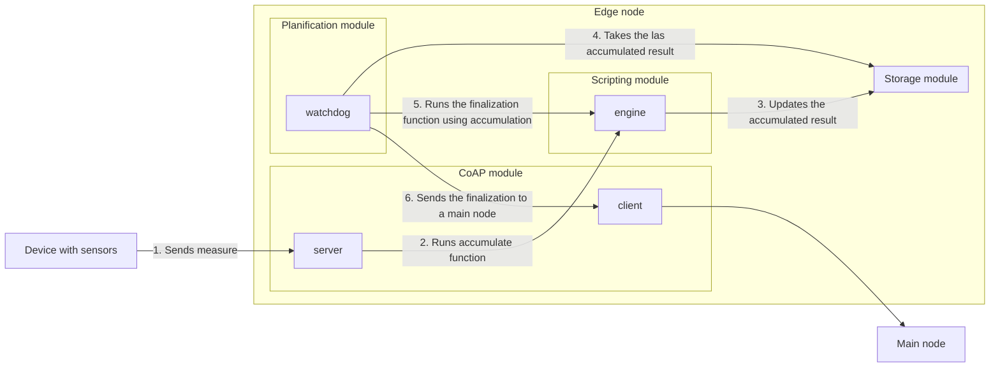

# COTILLA
Connected Operative Terminal for Information Logging and Local Analysis

## Summary 📝
The objective of this project is to develop a program that implements an IoT gateway with the following capabilities:
* Collect data from remote sensors via the CoAP protocol
* Group the measurements to perform user-defined aggregations
* Forward the aggregated measurements to another gateway using a mesh network
* Forward the aggregated measurements to an external service, if it is a master node
* Be user-configurable, allowing configurations to be distributed among the various nodes

## Logical structure 🧱

### Measure extraction and aggregation
In this case, the application is using the edge mode, this is, the application receives measures from some sensors and, when the watchdog of the planification module triggers, the accumulated measure is finalized and sent to the main node.



## Build, test and run ⚙️
Currently, COTILLA is a full-zig-based project, so no external dependencies are required, except for the zig compiler itself. To build the project the required command is:

```bash
zig build
```

To execute all tests defined on project, you can use this command:

```bash
zig build test --summary all
```

Finally, to run the project locally, simply run this command:

```bash
./zig-out/bin/COTILLA
```

Also, it's usefull to build and run once, by combining both commands:

```bash
zig build && ./zig-out/bin/COTILLA
```